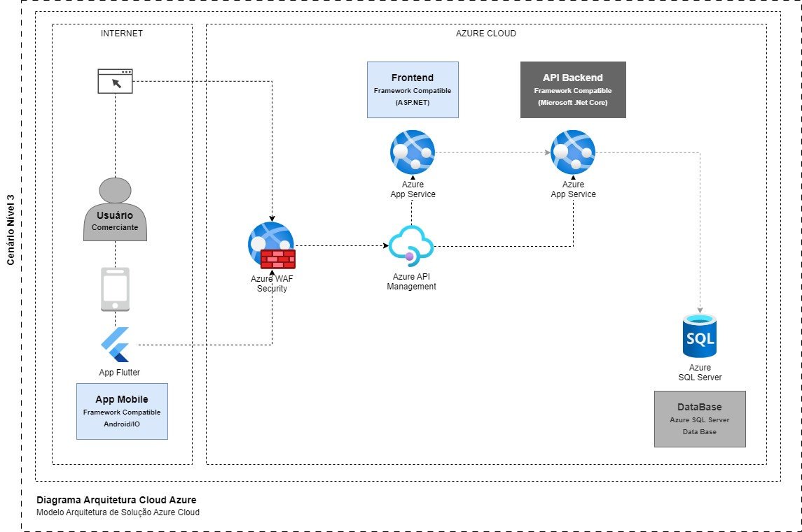
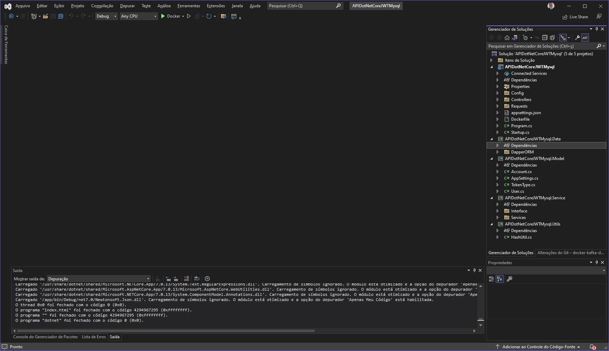

<h1>README</h1>

| Data | Autor | Comentários | Versão |
| --- | --- | --- | --- |
| 02/11/2023 | Paulo Uechi | Versao inicial | 0.0.1 |  

## Information ##

Projeto Desafio APIDotNetCoreJWTMysql

## Structure ##

| Item | Autor | Diretorio/Arquivo | Informação |
| --- | --- | --- | --- |
| 01 | Paulo Uechi | /APIDotNetCoreJWTMysql | Diretorio do Projeto API DotNetCore SDK 7.0 |  
| 02 | Paulo Uechi | /DockerMySQL | Diretorio do Container MySQL Server 8.2.0  |  
| 03 | Paulo Uechi | /design | Diretorio com desenhos feitos no Draw.io em C4 Model  |  
| 04 | Paulo Uechi | /images | Diretorio com images deste repositorio  |  
| 05 | Paulo Uechi | DotNetCore.postman_collection.json | Arquivo de importação do Postman  |  
| 06 | Paulo Uechi | LICENSE | Arquivo com Informações sobre a licença deste repositorio  |  
| 07 | Paulo Uechi | README.md | Arquivo Markdown com estas informações que você esta lendo  |  
| 08 | Paulo Uechi | build.bat | Arquivo BATCH com as configurações de construção e execução deste projeto no Windows  |  
| 09 | Paulo Uechi | build.sh | Arquivo Shellscript com as configurações de construção e execução deste projeto no Linux  |  

## Objective ##

Descritivo da Solução:  
Um comerciante precisa controlar o seu fluxo de caixa diário com os lançamentos (débitos e créditos), também precisa de um relatório que disponibilize o saldo diário consolidado.  
  
Requisitos de negócio:  
•	Serviço que faça o controle de lançamentos  
•	Serviço do consolidado diário  

Requisitos técnicos:  
•	Desenho da solução  
•	Pode ser feito na linguagem que você domina  
•	Boas praticas são bem vindas (Design Patterns, Padrões de Arquitetura, SOLID e etc)  
•	Readme com instruções de como subir a aplicação local, container e utilização dos serviços  
•	Hospedar em repositório publico (GitHub)  


## Dependencies ##

* Alpine version 3.18
* Microsoft DotNet Core SDK v.7.0
* Docker version 20.10.14  
* MySQL version v8.2.0

## Analisys Architeture and Solutions ##

Mediante os requisitos e informações do possível cliente foram decididos as seguintes soluções técnicas e de Arquitetura:

- Desenvolvimento do Microserviço API
- Utilização da Tecnologia Microsoft Dot Net Core SDK 7.0, API, Swagger, JWT, ORM Dapper
- Banco de dados Relacional do tipo SGDB Oracle MySQL
- A utilização de Container Docker para escalonamento e ambiente
- Os Container Docker pode ser facilmente implementados para PODs Kubernetes com Service Mash
- Arquitetura CQRS Command Query Responsibility Segregation para separação de canais
- Foram aplicados conceitos atuais C4 Model, Twelve Factor, DDD, SOLID, Clean Code, etc

Abaixo alguns desenhos de Arquitetura no Modelo C4

Arquitetura CQRS Modelo C3  


Nível de Negocio Modelo C1  


Nível de Negocio Modelo C2  


Nível de Negocio Modelo C3  


Nível de Negocio Cloud Modelo C3  



Solução desenvolvida no Microsoft Visual Studio 2022  



## Clone Project ##	

Clonar e baixar o projeto

```
$ git clone https://gitlab.com/uechi-lab/dotnetcore-jwt-mysql.git
```

ou

```
$ git git@gitlab.com:uechi-lab/dotnetcore-jwt-mysql.git
```

## How To Build and Run ##	

Para construir o projeto

```
# Linux
./build.sh
```


```
# Windows
build.bat
```


## Docker Information ##

Informações sobre os recursos no docker abrir o Docker Desktop no Windows


Ou acesse o terminal ou bash e digite os comandos abaixo

```
$ docker ps -a
$ docker image -a
$ docker volume ls
$ docker network ls
$ docker system df
```


## Access Information ##

Endereço Swagger: http://localhost:5000/swagger/index.html  


O arquivo JSON de importação para carregar no Postman esta disponivel no repositorio DotNetCore.postman_collection.json  


## DDL Scripts MySQL Load

```
CREATE DATABASE `dbapidotnetcore` /*!40100 DEFAULT CHARACTER SET utf8mb3 */ /*!80016 DEFAULT ENCRYPTION='N' */;

USE `dbapidotnetcore`;

CREATE TABLE `Account` (
  `Id` int NOT NULL AUTO_INCREMENT,
  `UserLogin` varchar(100) DEFAULT NULL,
  `DateRegister` datetime DEFAULT NULL,
  `InputType` varchar(100) CHARACTER SET utf8mb3 COLLATE utf8mb3_general_ci DEFAULT NULL,
  `InputValue` decimal(10,2) DEFAULT NULL,
  PRIMARY KEY (`Id`),
  KEY `account_id_IDX` (`Id`) USING BTREE
) ENGINE=InnoDB AUTO_INCREMENT=1 DEFAULT CHARSET=utf8mb3;


CREATE TABLE `User` (
  `Id` int NOT NULL AUTO_INCREMENT,
  `Name` varchar(50) DEFAULT NULL,
  `Surname` varchar(50) DEFAULT NULL,
  `Email` varchar(150) DEFAULT NULL,
  `Phone` char(10) CHARACTER SET utf8mb3 COLLATE utf8mb3_general_ci DEFAULT NULL,
  `LastLogon` datetime(6) DEFAULT NULL,
  `CreatedOn` datetime(6) DEFAULT NULL,
  `ActivationCode` int DEFAULT NULL,
  `Login` varchar(50) NOT NULL,
  `Password` varchar(150) NOT NULL,
  PRIMARY KEY (`Id`)
) ENGINE=InnoDB AUTO_INCREMENT=1 DEFAULT CHARSET=utf8mb3;

```

Utilização do DBeaver para Banco de Dados


## More Info ##

Este projeto é uma POC qualquer duvida ou informação contate: paulouechi@gmail.com  


